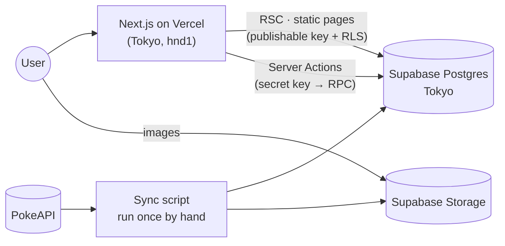

# Pokepedia

[한국어](README.md) · **English** · [日本語](README.ja.md)

A Pokédex of the 151 Gen 1 Pokémon, a Game Boy–style battle game where you name the Pokémon from its silhouette, and a sticker collection that fills up as you get them right.

A side project: I rebuilt a JSP app my team made in 2023 ([PikapediaProject](https://github.com/ottuck/PikapediaProject)) on my own, with a current stack.

**[pokepedia-rust-six.vercel.app](https://pokepedia-rust-six.vercel.app)** · [Design notes](docs/system_design.md) (Korean)

<table>
  <tr>
    <td width="50%"></td>
    <td width="50%"></td>
  </tr>
  <tr>
    <td></td>
    <td></td>
  </tr>
  <tr>
    <td></td>
    <td></td>
  </tr>
</table>

## What's in it

- **Dex**: all 151 on one page. Search by Korean, English or Japanese name or by number; the type filter and sort live in the URL.
- **Detail**: stats, abilities, evolution line. The artwork is a holographic card that tilts with the mouse (or your finger on mobile), and you can flip it to the shiny version.
- **Game**: name the Pokémon from its silhouette. Fight / Bag (hint) / Pokémon (skip) / Run, with arrow keys and Z too. Wrong answers cost HP; a streak raises the score multiplier and the shiny sticker odds. Names in all three languages count.
- **Collection and leaderboard**: 151 sticker slots, and a best-score ranking per player.
- **Accounts**: start right away as a guest; link Google later and your progress comes with you.
- Korean, English and Japanese, light and dark mode.

## Stack

Next.js 16 (App Router, RSC, Server Actions) · React 19 · TypeScript · Tailwind CSS v4 · Motion · Zustand · Zod · next-intl ·
Supabase (Postgres, Auth, Storage) · Vitest · Playwright · Vercel



Pokémon data and images are pulled from PokeAPI once and kept in Supabase, so nothing calls an outside API at runtime. The dex and the detail pages (151 × 3 languages) are all prerendered at build time.

## Running it locally

You need Node 24, pnpm and Docker.

```bash
pnpm install
pnpm supabase start            # local Postgres, Auth, Storage (Docker)
cp .env.example .env.local     # values from `pnpm supabase status -o env`
pnpm sync:pokemon              # PokeAPI → local DB and Storage (once; otherwise only the 3 seed Pokémon)
pnpm dev
```

- `pnpm check`: lint · typecheck · format · unit tests
- `pnpm test:db`: RLS and RPC tests on the local Supabase
- `pnpm test:e2e`: Playwright

---

<sub>Pokémon and all related names and artwork are trademarks and © of Nintendo, Creatures Inc. and GAME FREAK inc. This is a non-commercial fan project.</sub>
