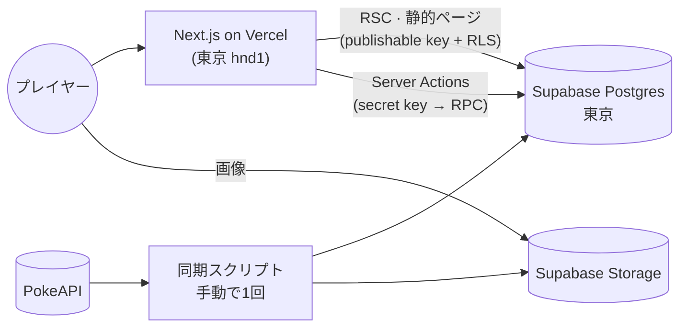

<div align="center">


# Pokepedia

**だーれだ？** ゲームボーイ風のシルエットバトル、第1世代ポケモン図鑑、<br/>
そして当てるたびに1枚ずつ埋まっていくシール帳。

### [pokepedia.devで遊ぶ →](https://pokepedia.dev)

[English](README.md) · [한국어](README.ko.md) · **日本語**

<br/>


</div>

<br/>

シルエットが現れます。名前を当てれば（日本語・英語・韓国語のどれでも）シールとして自分のものに。
3回まちがえるとゲームオーバーです。

プログラミングを学び始めたころにJSPだけで作った[PikapediaProject](https://github.com/ottuck/PikapediaProject)を、
いまどきのスタックでゼロから作り直しました。ほとんどは作るのが楽しかったからです。

## ゲーム

<table>
  <tr>
    <td width="50%"></td>
    <td width="50%"></td>
  </tr>
</table>

- **たたかう**で答え、**バッグ**はヒント、**ポケモン**はスキップ、**にげる**でおしまい。矢印キーとZキーでも操作できます。
- まちがえるとHPが減ります。連続で当てるとスコア倍率と色違いシールの確率が上がります。
- ピカチュウ、Pikachu、피카츄のどれで答えても正解です。
- 登録は不要。ゲストで始めて、あとからGoogleを連携しても集めた記録はそのままです。

## 図鑑

<table>
  <tr>
    <td width="74%"></td>
    <td width="26%"></td>
  </tr>
</table>


- 151匹を1ページに。3言語の名前か番号で検索でき、タイプの絞り込みと並び順はURLに残ります。
- 1匹ずつ能力値、特性、進化の流れ。アートワークはマウス（または指）に合わせて傾くホログラムカードで、タップひとつで色違いの姿に切り替わります。

## シール帳


色違いまで埋めていく151枠と、みんなのベスト記録を集めたランキング。

## 中身

Next.js 16 (App Router, RSC, Server Actions) · React 19 · TypeScript · Tailwind CSS v4 · Motion ·
Zustand · Zod · next-intl · Supabase (Postgres, Auth, Storage) · Vitest · Playwright · Vercel



- ポケモンのデータとアートワークはPokeAPIから一度だけ取り込んでSupabaseに置いてあり、実行時に外部APIは呼びません。
- 図鑑と詳細ページのすべて（151 × 3言語）をビルド時にprerenderしています。
- 正誤の判定はすべてサーバーが行い、答えがブラウザに渡ることはありません。

もっと詳しい話（スキーマ、ゲームのルール、ゲストの記録をGoogleアカウントにまとめる仕組み、何をなぜテストしているか）は[設計ドキュメント](docs/system_design.md)（韓国語）にあります。

## ローカルで動かす

Node 24、pnpm、Dockerが必要です。

```bash
pnpm install
pnpm supabase start            # ローカルのPostgres・Auth・Storage (Docker)
cp .env.example .env.local     # 値は `pnpm supabase status -o env` で確認
pnpm sync:pokemon              # PokeAPI → ローカルDB・Storage（最初に一度。しないとシードの3匹だけ）
pnpm dev
```

- `pnpm check`：lint · typecheck · format · 単体テスト
- `pnpm test:db`：ローカルSupabaseでのRLS・RPCテスト
- `pnpm test:e2e`：Playwright

---

<sub>ソースコードは[MITライセンス](LICENSE)です。Pokémonおよび関連する名称・アートワークの権利は任天堂、クリーチャーズ、ゲームフリークに帰属します。非営利のファンプロジェクトです。</sub>
