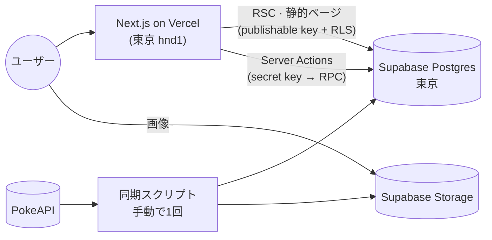

# Pokepedia

[한국어](README.md) · [English](README.en.md) · **日本語**

第1世代ポケモン151匹の図鑑、シルエットを見て名前を当てるゲームボーイ風バトルゲーム、正解するとたまっていくシールコレクション。

2023年にチームで作ったJSPプロジェクト（[PikapediaProject](https://github.com/ottuck/PikapediaProject)）を、いまどきのスタックで一人で作り直したサイドプロジェクトです。

**[pokepedia-rust-six.vercel.app](https://pokepedia-rust-six.vercel.app)** · [設計ドキュメント](docs/system_design.md)（韓国語）

<table>
  <tr>
    <td width="50%"></td>
    <td width="50%"></td>
  </tr>
  <tr>
    <td></td>
    <td></td>
  </tr>
  <tr>
    <td></td>
    <td></td>
  </tr>
</table>

## できること

- **図鑑**：151匹を1ページに。日本語・英語・韓国語の名前か番号で検索でき、タイプの絞り込みと並び順はURLに残ります。
- **詳細**：能力値、特性、進化の流れ。アートワークはマウス（スマホでは指）に合わせて傾くホログラムカードで、色違いの姿にも切り替えられます。
- **ゲーム**：シルエットだけを見て名前を当てます。たたかう / バッグ（ヒント）/ ポケモン（スキップ）/ にげる。矢印キーとZキーでも操作できます。間違えるとHPが減り、連続で当てるとスコア倍率と色違いシールの確率が上がります。3言語どの名前でも正解です。
- **コレクション・ランキング**：シール151枠と、プレイヤーごとのベストスコアのランキング。
- **アカウント**：登録なしでゲストとしてすぐ遊べて、あとからGoogleを連携しても記録はそのまま引き継がれます。
- 韓国語・英語・日本語。

## スタック

Next.js 16 (App Router, RSC, Server Actions) · React 19 · TypeScript · Tailwind CSS v4 · Motion · Zustand · Zod · next-intl ·
Supabase (Postgres, Auth, Storage) · Vitest · Playwright · Vercel



ポケモンのデータと画像はPokeAPIから一度だけ取り込んでSupabaseに置いてあり、実行時に外部APIは呼びません。図鑑と詳細ページ（151 × 3言語）はビルド時にすべてprerenderしています。

## ローカルで動かす

Node 24、pnpm、Dockerが必要です。

```bash
pnpm install
pnpm supabase start            # ローカルのPostgres・Auth・Storage (Docker)
cp .env.example .env.local     # 値は `pnpm supabase status -o env` で確認
pnpm sync:pokemon              # PokeAPI → ローカルDB・Storage（最初に一度。しないとシードの3匹だけ）
pnpm dev
```

- `pnpm check`：lint · typecheck · format · 単体テスト
- `pnpm test:db`：ローカルSupabaseでのRLS・RPCテスト
- `pnpm test:e2e`：Playwright

---

<sub>Pokémonおよび関連する名称・アートワークの権利は任天堂、クリーチャーズ、ゲームフリークに帰属します。非営利のファンプロジェクトです。</sub>
