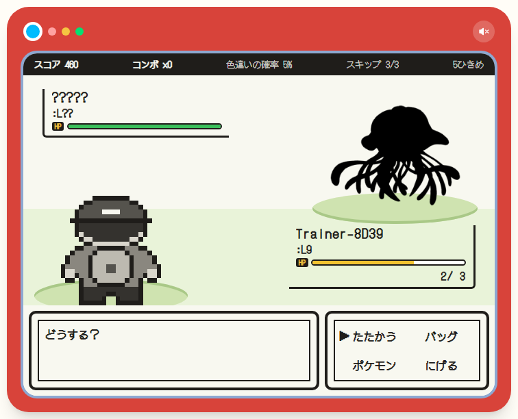
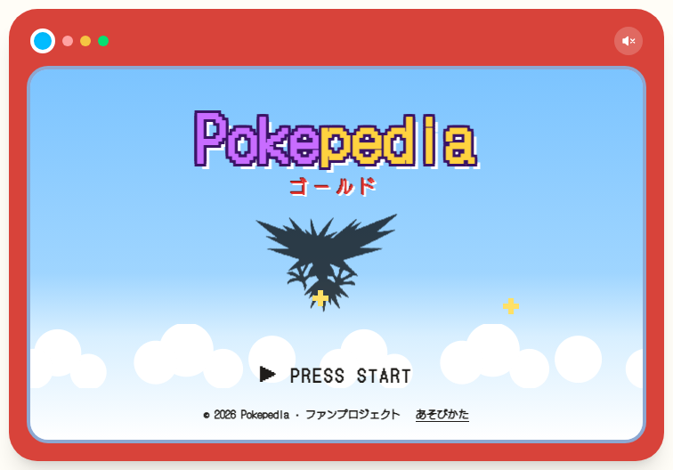
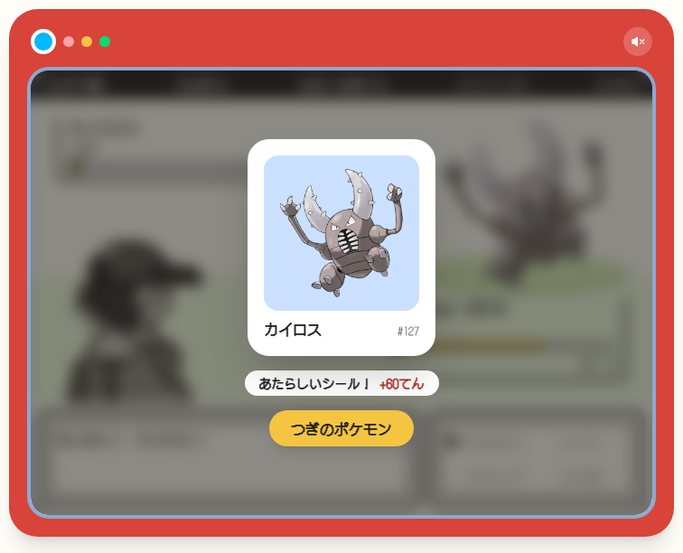
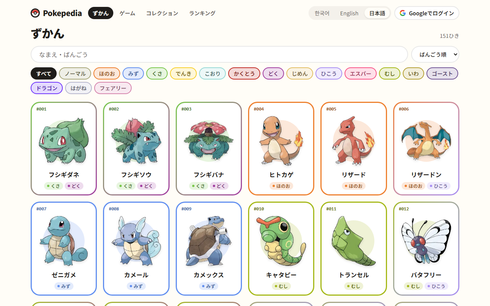
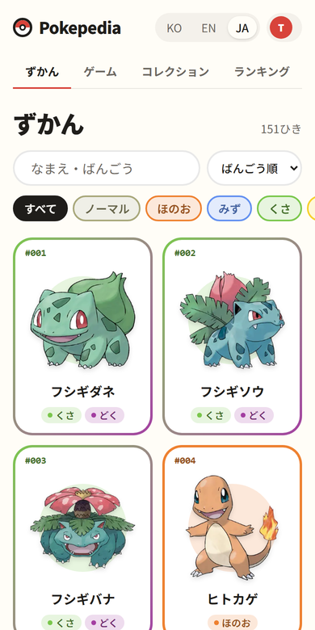
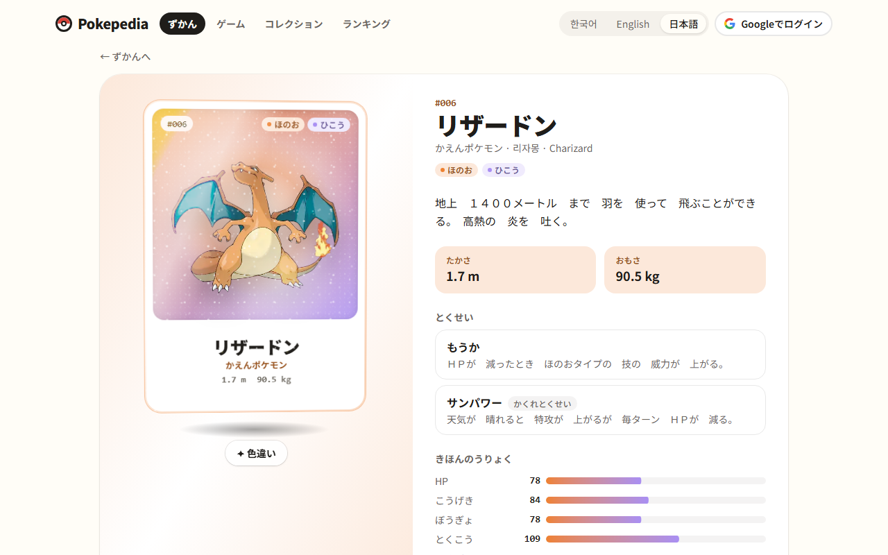
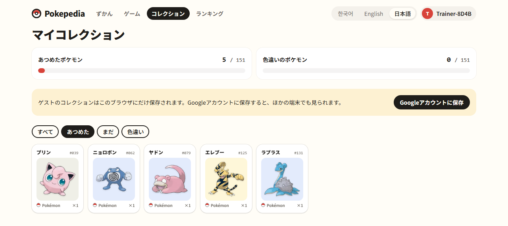
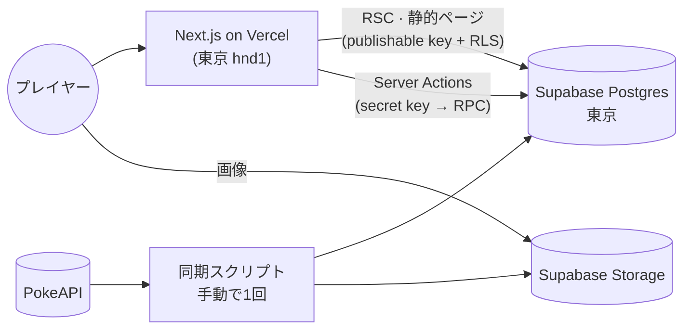

<div align="center">


# Pokepedia

**このポケモン、だーれだ？** ゲームボーイ風のシルエットバトルと第1世代のポケモン図鑑、<br/>
そして当てるたびに1枚ずつ増えていくシール帳。

### [pokepedia.devで遊ぶ →](https://pokepedia.dev)

[English](README.md) · [한국어](README.ko.md) · **日本語**

<br/>



</div>

<br/>

シルエットで出てくるポケモンの名前を当ててください。日本語・英語・韓国語、どの名前で答えてもOKです。
当たるとトレーナーがモンスターボールを投げて、そのポケモンがシールになってシール帳に入ります。3回まちがえるとゲームオーバーです。

## ゲーム

<table>
  <tr>
    <td width="50%"></td>
    <td width="50%"></td>
  </tr>
</table>

- **たたかう**で答えます。わからないときは**ヒント**で名前の半分が見られます。**スキップ**で次のポケモンへ、**にげる**でゲーム終了。矢印キーとZキーでも遊べます。
- まちがえるとHPが減ります。続けて当てるほどスコア倍率が上がり、色違いシールも出やすくなります。
- ピカチュウ、Pikachu、피카츄、どれで答えても正解です。
- 登録はいりません。ゲストですぐに遊べて、あとからGoogleアカウントを連携しても集めたシールと記録はそのまま残ります。

## 図鑑

<table>
  <tr>
    <td width="74%"></td>
    <td width="26%"></td>
  </tr>
</table>



- 151匹を1ページで見られます。3言語の名前か番号で探せて、タイプの絞り込みと並び順はURLに残ります。
- ポケモンごとに能力値、特性、進化のようすを確認できます。アートワークはマウスや指の動きに合わせて傾くホログラムカードで、タップすると色違いの姿に変わります。

## シール帳



色違いも含めて、151枠を少しずつ埋めていくのが楽しみです。ランキングではほかの人のベスト記録も見られます。

## 中身

Next.js 16 (App Router, RSC, Server Actions) · React 19 · TypeScript · Tailwind CSS v4 · Motion ·
Zustand · Zod · next-intl · Supabase (Postgres, Auth, Storage) · Vitest · Playwright · Vercel



- ポケモンのデータとアートワークはPokeAPIから一度だけ取り込んで、Supabaseに保存しています。動いているあいだに外部APIは呼びません。
- 図鑑と詳細ページ（151匹 × 3言語）はビルド時にあらかじめ生成しています。
- 正誤の判定はすべてサーバー側で行うので、答えがブラウザに届くことはありません。

スキーマ、ゲームのルール、ゲストの記録をGoogleアカウントに引き継ぐ仕組み、何をなぜテストしているかなど、くわしくは[設計ドキュメント](docs/system_design.md)（韓国語）にまとめています。

## ローカルで動かす

Node 24、pnpm、Dockerが必要です。

```bash
pnpm install
pnpm supabase start            # ローカルのPostgres・Auth・Storage (Docker)
cp .env.example .env.local     # 値は `pnpm supabase status -o env` で確認
pnpm sync:pokemon              # PokeAPI → ローカルDB・Storage（最初に一度。しないとシードデータの3匹だけになります）
pnpm dev
```

- `pnpm check`：lint · typecheck · format · 単体テスト
- `pnpm test:db`：ローカルSupabaseでのRLS・RPCテスト
- `pnpm test:e2e`：Playwright

---

<sub>ソースコードは[MITライセンス](LICENSE)です。Pokémonおよび関連する名称・アートワークの権利は任天堂、株式会社ポケモン、クリーチャーズ、ゲームフリークに帰属し、MITライセンスの対象外です。本プロジェクトは非公式・非営利のファンプロジェクトで、これらの企業とは関係がなく、承認も受けていません。</sub>
