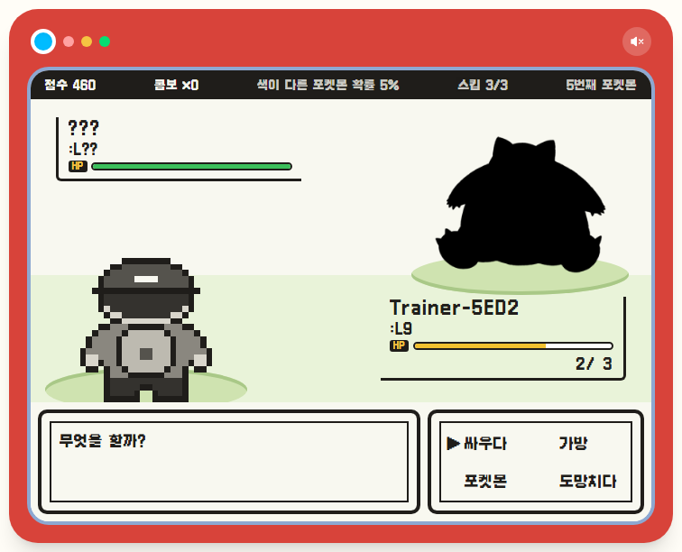
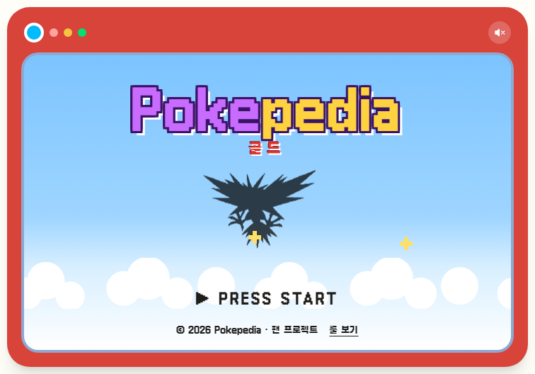
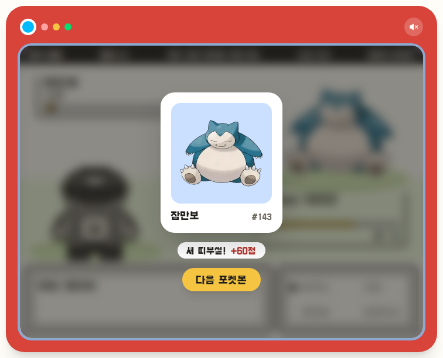
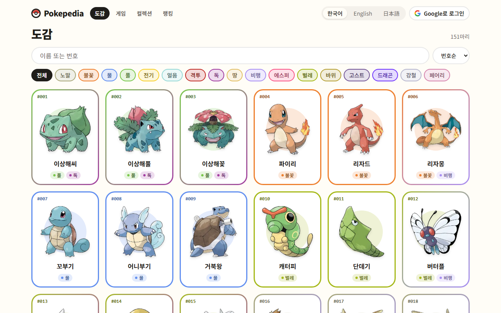
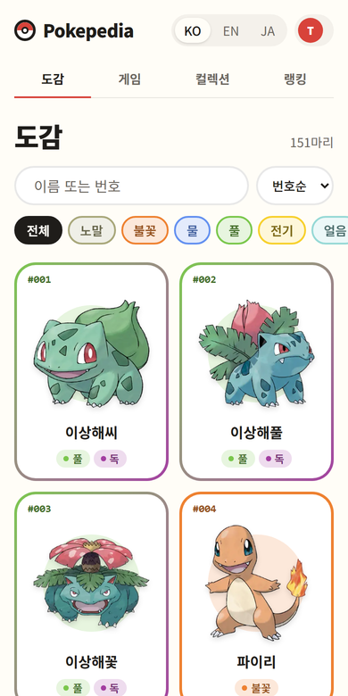
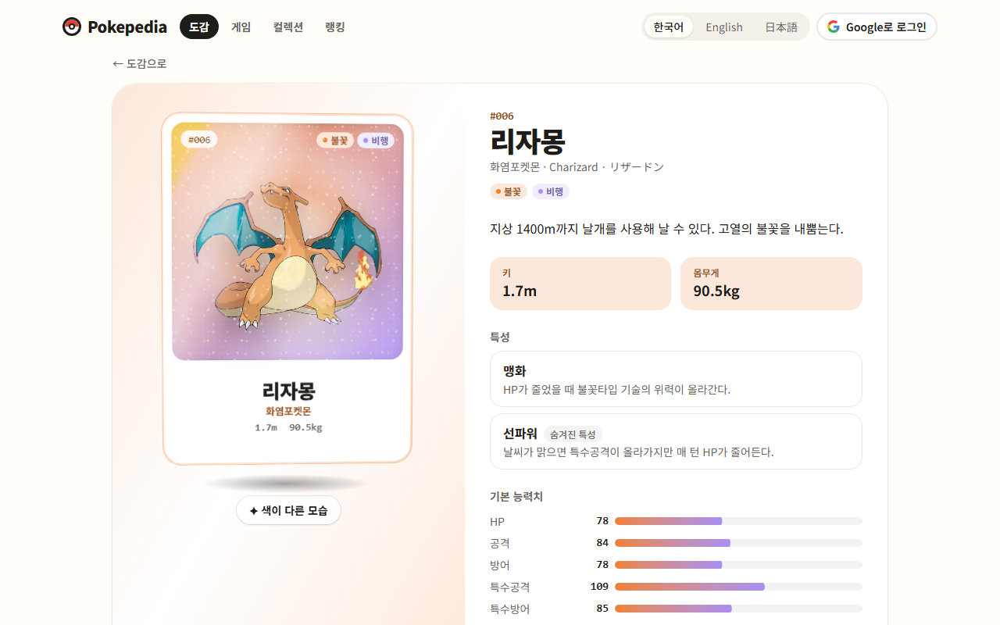
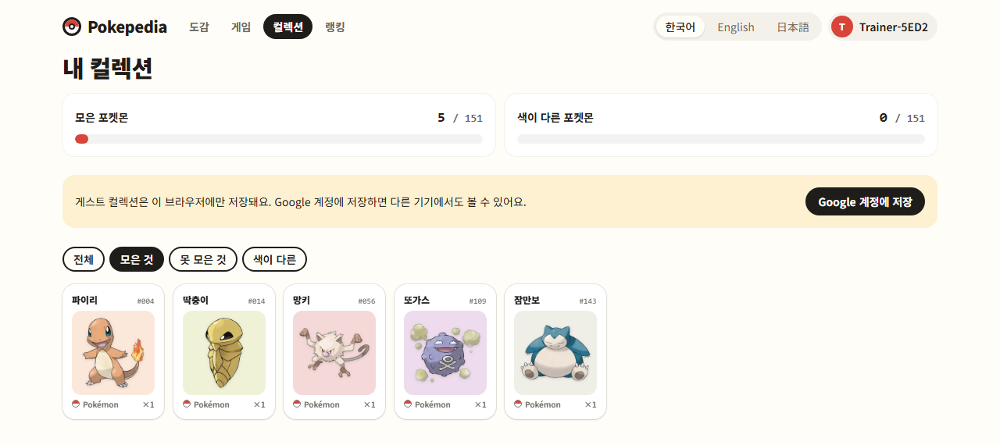
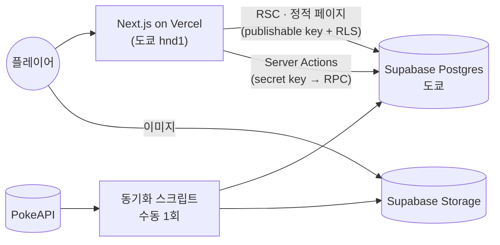

<div align="center">


# Pokepedia

**이 포켓몬은 누구일까?** GB 감성의 실루엣 배틀, 1세대 포켓몬 도감,<br/>
그리고 맞힐 때마다 한 장씩 채워지는 띠부씰 컬렉션.

### [pokepedia.dev에서 플레이 →](https://pokepedia.dev)

[English](README.md) · **한국어** · [日本語](README.ja.md)

<br/>



</div>

<br/>

실루엣이 나타난다. 이름을 맞히면(한국어·영어·일본어 아무거나) 띠부씰로 내 것이 된다.
세 번 틀리면 게임 오버.

코딩을 처음 배울 때 JSP로만 만들었던 [PikapediaProject](https://github.com/ottuck/PikapediaProject)를
요즘 스택으로 처음부터 다시 만들었다. 대부분은 만드는 게 재밌어서다.

## 게임

<table>
  <tr>
    <td width="50%"></td>
    <td width="50%"></td>
  </tr>
</table>

- **싸우다**로 답하고, **가방**은 힌트, **포켓몬**은 스킵, **도망치다**는 그만하기. 방향키와 Z키로도 된다.
- 틀리면 HP가 깎인다. 연속으로 맞히면 점수 배율과 색이 다른 띠부씰 확률이 올라간다.
- 피카츄, Pikachu, ピカチュウ 중 뭘로 답해도 정답이다.
- 가입은 필요 없다. 게스트로 시작하고, 나중에 Google을 연결해도 모은 기록은 그대로다.

## 도감

<table>
  <tr>
    <td width="74%"></td>
    <td width="26%"></td>
  </tr>
</table>



- 151마리를 한 페이지에. 세 언어 이름이나 번호로 검색하고, 타입 필터와 정렬은 URL에 남는다.
- 포켓몬마다 능력치, 특성, 진화 라인. 아트워크는 마우스(또는 손가락)를 따라 기우는 홀로그램 카드이고, 한 번 누르면 색이 다른 모습으로 바뀐다.

## 띠부씰 컬렉션



색이 다른 것까지 채워 나가는 151칸, 그리고 모두의 최고 기록을 모은 랭킹.

## 내부 구조

Next.js 16 (App Router, RSC, Server Actions) · React 19 · TypeScript · Tailwind CSS v4 · Motion ·
Zustand · Zod · next-intl · Supabase (Postgres, Auth, Storage) · Vitest · Playwright · Vercel



- 포켓몬 데이터와 아트워크는 PokeAPI에서 한 번 가져와 Supabase에 두고, 런타임에는 외부 API를 부르지 않는다.
- 도감과 상세 페이지 전부(151 × 3개 언어)를 빌드 때 prerender한다.
- 정답 판정은 전부 서버가 하고, 정답은 브라우저로 넘어가지 않는다.

더 긴 이야기(스키마, 게임 규칙, 게스트 기록을 Google 계정으로 합치는 방법, 무엇을 왜 테스트하는지)는 [설계 문서](docs/system_design.md)에 있다.

## 로컬에서 돌리기

Node 24, pnpm, Docker가 필요하다.

```bash
pnpm install
pnpm supabase start            # 로컬 Postgres·Auth·Storage (Docker)
cp .env.example .env.local     # 값은 `pnpm supabase status -o env`에서 확인
pnpm sync:pokemon              # PokeAPI → 로컬 DB·Storage (처음 한 번, 안 하면 시드 3마리만)
pnpm dev
```

- `pnpm check`: lint · typecheck · format · 단위 테스트
- `pnpm test:db`: 로컬 Supabase RLS·RPC 테스트
- `pnpm test:e2e`: Playwright

---

<sub>Pokémon과 관련 이름·아트워크의 권리는 Nintendo, Creatures Inc., GAME FREAK inc.에 있습니다. 비상업적 팬 프로젝트입니다.</sub>
