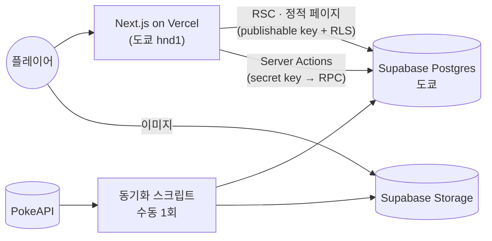

<div align="center">


# Pokepedia

**이 포켓몬은 누구일까?** 게임보이 느낌의 실루엣 배틀과 1세대 포켓몬 도감,<br/>
그리고 맞힐 때마다 한 장씩 늘어나는 띠부씰 컬렉션이 있어요.

### [pokepedia.dev에서 바로 플레이 →](https://pokepedia.dev)

[English](README.md) · **한국어** · [日本語](README.ja.md)

<br/>


</div>

<br/>

실루엣으로 나온 포켓몬의 이름을 맞혀 보세요. 한국어, 영어, 일본어 중 아무 이름으로 답해도 돼요.
맞히면 트레이너가 몬스터볼을 던지고, 그 포켓몬은 띠부씰이 되어 컬렉션에 들어가요. 세 번 틀리면 게임 오버예요.

## 게임

<table>
  <tr>
    <td width="50%"></td>
    <td width="50%"></td>
  </tr>
</table>

- **싸우다**를 눌러 답하고, 막히면 **힌트**로 이름 절반을 볼 수 있어요. **넘기기**는 다음 포켓몬으로, **도망치다**는 게임 끝내기예요. 방향키와 Z키로도 할 수 있어요.
- 틀리면 HP가 줄어요. 연속으로 맞힐수록 점수 배율이 오르고, 색이 다른 띠부씰도 잘 나와요.
- 피카츄, Pikachu, ピカチュウ 중 어떤 이름으로 답해도 정답이에요.
- 가입하지 않아도 돼요. 게스트로 바로 시작하고, 나중에 Google 계정을 연결해도 모은 띠부씰과 기록은 그대로 남아요.

## 도감

<table>
  <tr>
    <td width="74%"></td>
    <td width="26%"></td>
  </tr>
</table>


- 151마리를 한 페이지에서 볼 수 있어요. 세 언어 이름이나 번호로 찾을 수 있고, 타입 필터와 정렬 상태는 주소에 남아요.
- 포켓몬마다 능력치, 특성, 진화 단계를 보여 줘요. 아트워크는 마우스나 손가락을 따라 기울어지는 홀로그램 카드로 나오고, 누르면 색이 다른 모습으로 바뀌어요.

## 띠부씰 컬렉션


색이 다른 띠부씰까지 151칸을 하나씩 채워 가는 재미가 있어요. 랭킹에서는 다른 사람들의 최고 기록도 볼 수 있어요.

## 내부 구조

Next.js 16 (App Router, RSC, Server Actions) · React 19 · TypeScript · Tailwind CSS v4 · Motion ·
Zustand · Zod · next-intl · Supabase (Postgres, Auth, Storage) · Vitest · Playwright · Vercel



- 포켓몬 데이터와 아트워크는 PokeAPI에서 한 번만 가져와 Supabase에 저장해 둬요. 서비스 중에는 외부 API를 부르지 않아요.
- 도감과 상세 페이지(151마리 × 3개 언어)는 빌드할 때 미리 만들어 둬요.
- 정답 판정은 모두 서버에서 해요. 그래서 정답이 브라우저로 넘어가지 않아요.

스키마, 게임 규칙, 게스트 기록을 Google 계정으로 합치는 방법, 무엇을 왜 테스트하는지 같은 자세한 이야기는 [설계 문서](docs/system_design.md)에 정리해 뒀어요.

## 로컬에서 돌리기

Node 24, pnpm, Docker가 필요해요.

```bash
pnpm install
pnpm supabase start            # 로컬 Postgres·Auth·Storage (Docker)
cp .env.example .env.local     # 값은 `pnpm supabase status -o env`에서 확인
pnpm sync:pokemon              # PokeAPI → 로컬 DB·Storage (처음 한 번. 안 하면 시드 데이터 3마리만 나와요)
pnpm dev
```

- `pnpm check`: lint · typecheck · format · 단위 테스트
- `pnpm test:db`: 로컬 Supabase RLS·RPC 테스트
- `pnpm test:e2e`: Playwright

---

<sub>소스 코드는 [MIT 라이선스](LICENSE)입니다. Pokémon과 관련 이름·아트워크의 권리는 Nintendo, The Pokémon Company, Creatures Inc., GAME FREAK inc.에 있으며 MIT 라이선스 대상이 아닙니다. 이 프로젝트는 비공식·비영리 팬 프로젝트이며, 위 회사들과 관련이 없고 승인을 받지 않았습니다.</sub>
