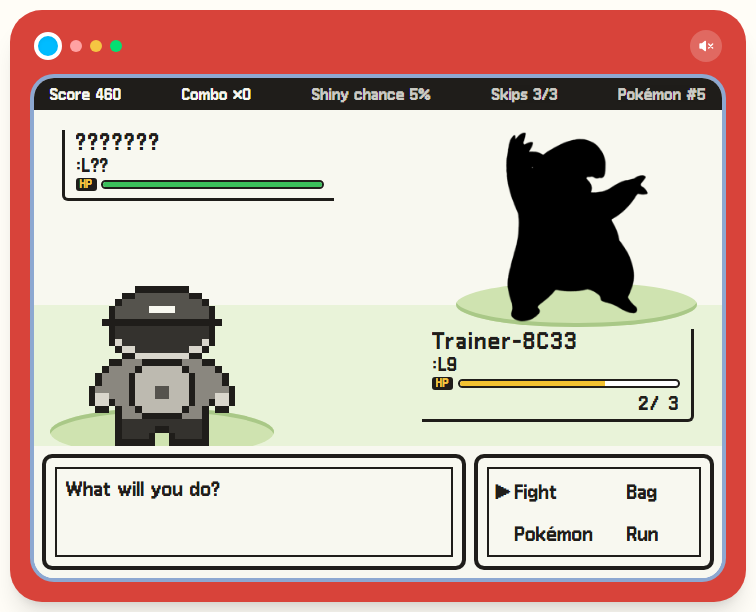
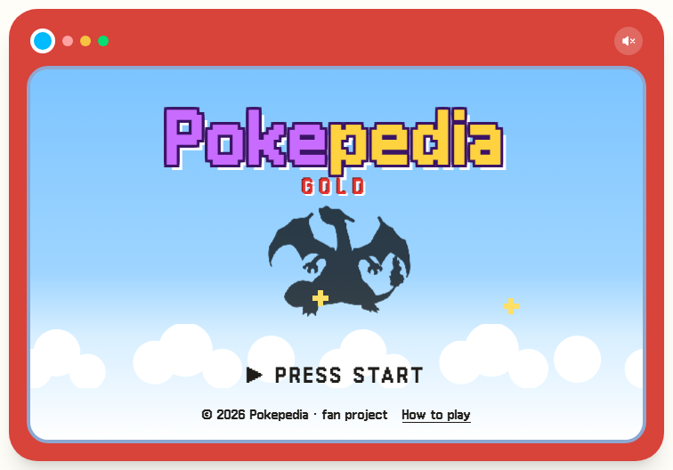
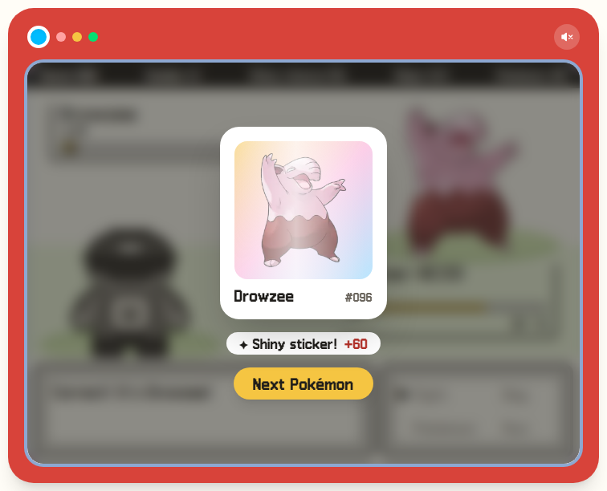
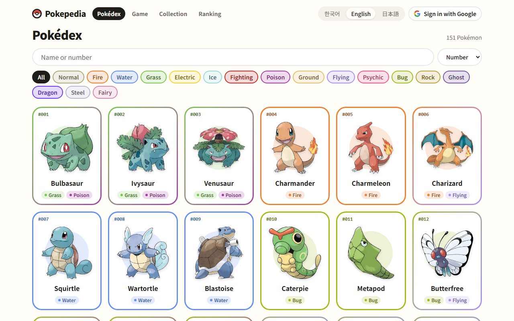
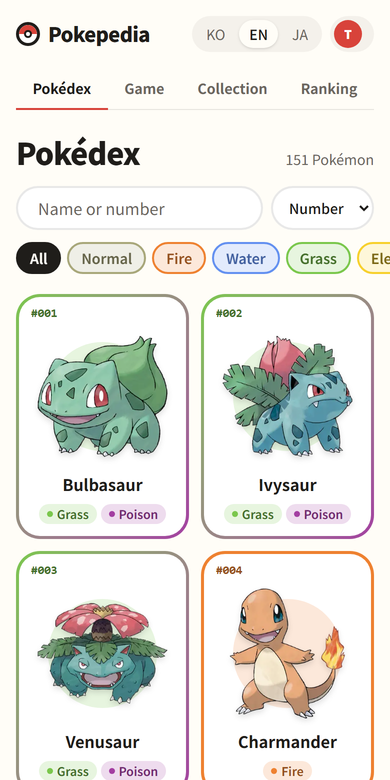
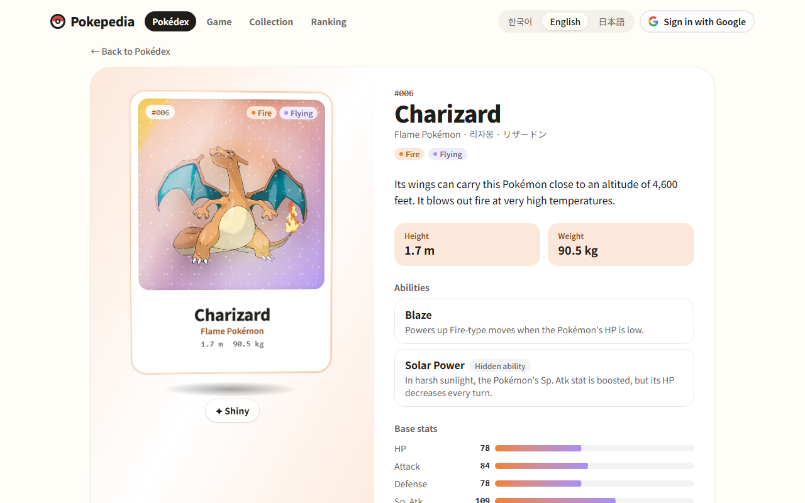
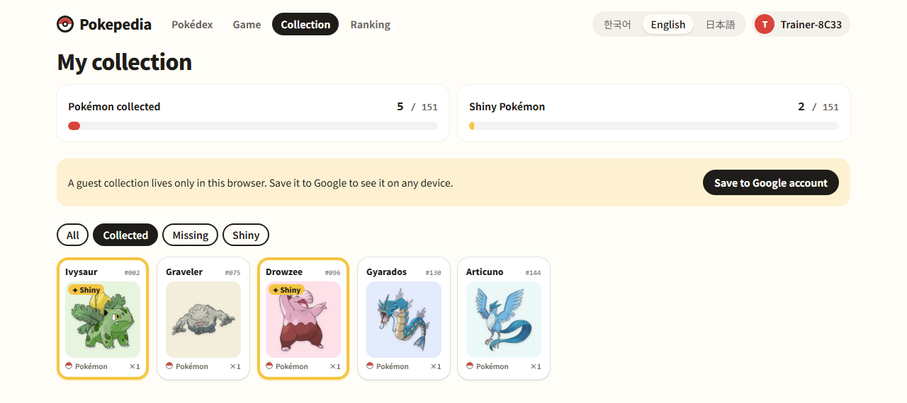
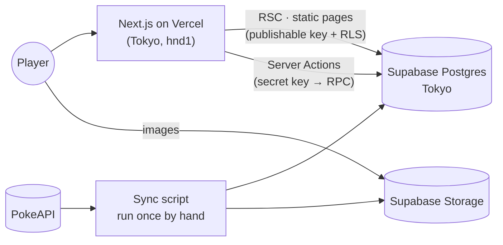

<div align="center">


# Pokepedia

**Who's that Pokémon?** A Game Boy–style silhouette battle, a Gen 1 Pokédex,<br/>
and a sticker book that fills up every time you get one right.

### [Play at pokepedia.dev →](https://pokepedia.dev)

**English** · [한국어](README.ko.md) · [日本語](README.ja.md)

<br/>



</div>

<br/>

A silhouette appears. Name it (in English, Korean or Japanese) and it's yours as a sticker.
Miss three times and the run is over.

This is a remake of [PikapediaProject](https://github.com/ottuck/PikapediaProject), a JSP-only app
from back when I was first learning to code. I rebuilt it from scratch on a current stack, mostly
because it was fun.

## The game

<table>
  <tr>
    <td width="50%"></td>
    <td width="50%"></td>
  </tr>
</table>

- **Fight** to answer, **Bag** for a hint, **Pokémon** to skip, **Run** to call it a day. Arrow keys and Z work too.
- Wrong answers cost HP. A streak raises the score multiplier and the odds of a shiny sticker.
- Pikachu, 피카츄 or ピカチュウ: any of the three names counts.
- No sign-up. You start as a guest, and linking Google later keeps everything you've collected.

## The Pokédex

<table>
  <tr>
    <td width="74%"></td>
    <td width="26%"></td>
  </tr>
</table>



- All 151 on one page. Search by name in any of the three languages or by number; the type filter and sort live in the URL.
- Stats, abilities and the evolution line for each one. The artwork is a holographic card that tilts with your cursor (or finger), and flips to the shiny version with one tap.

## The sticker book



151 slots to fill, shiny ones included, plus a leaderboard of everyone's best run.

## Under the hood

Next.js 16 (App Router, RSC, Server Actions) · React 19 · TypeScript · Tailwind CSS v4 · Motion ·
Zustand · Zod · next-intl · Supabase (Postgres, Auth, Storage) · Vitest · Playwright · Vercel



- Pokémon data and artwork are pulled from PokeAPI once and kept in Supabase; nothing calls an outside API at runtime.
- The dex and all detail pages (151 × 3 languages) are prerendered at build time.
- The server judges every answer, so the answer never reaches the browser.

The longer story (schema, game rules, how guests merge into Google accounts, what's tested and why) is in the [design notes](docs/system_design.md) (Korean).

## Running it locally

You need Node 24, pnpm and Docker.

```bash
pnpm install
pnpm supabase start            # local Postgres, Auth, Storage (Docker)
cp .env.example .env.local     # values from `pnpm supabase status -o env`
pnpm sync:pokemon              # PokeAPI → local DB and Storage (once; otherwise only the 3 seed Pokémon)
pnpm dev
```

- `pnpm check`: lint · typecheck · format · unit tests
- `pnpm test:db`: RLS and RPC tests on the local Supabase
- `pnpm test:e2e`: Playwright

---

<sub>Pokémon and all related names and artwork are trademarks and © of Nintendo, Creatures Inc. and GAME FREAK inc. This is a non-commercial fan project.</sub>
