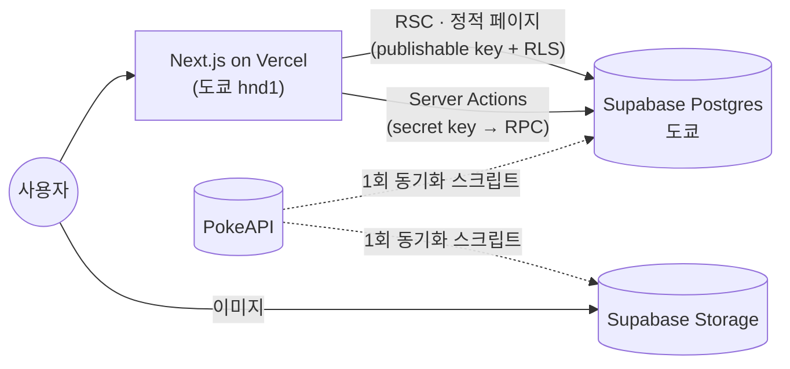

<div align="center">

# Pokepedia

**1세대 포켓몬 151마리 도감 · GB 배틀 스타일 이름 맞히기 게임 · 띠부씰 컬렉션**

2023년 JSP 팀 프로젝트([PikapediaProject](https://github.com/ottuck/PikapediaProject))를
Next.js 16 + Supabase로 처음부터 다시 만든 리메이크입니다.

[**라이브 데모**](https://pokepedia-rust-six.vercel.app) · [시스템 설계 문서](docs/system_design.md)

[](https://github.com/ottuck/pokepedia/actions/workflows/ci.yml)


</div>

<table>
  <tr>
    <td width="50%"></td>
    <td width="50%"></td>
  </tr>
  <tr>
    <td></td>
    <td></td>
  </tr>
</table>

## 주요 기능

| 기능           | 설명                                                                                                                  |
| -------------- | --------------------------------------------------------------------------------------------------------------------- |
| 📖 도감        | 151마리를 한 페이지에서 한국어·영어·일본어 이름이나 번호로 검색하고, 타입 필터와 정렬을 URL에 남깁니다.               |
| 🃏 상세        | 능력치·특성·진화 라인과 함께, 마우스와 손가락을 따라 기우는 3D 홀로그램 카드. 색이 다른 모습으로 바꿔 볼 수 있습니다. |
| ⚔️ 게임        | 실루엣만 보고 이름을 맞히는 GB 배틀 화면. 싸우다·가방(힌트)·포켓몬(스킵)·도망치다, 방향키와 Z키로도 조작합니다.       |
| ✨ 보상        | 맞히면 그 포켓몬의 띠부씰을 얻습니다. 연속으로 맞힐수록 점수 배율과 색이 다른 띠부씰 확률이 올라갑니다.               |
| 🗂️ 컬렉션      | 151칸 중 모은 칸이 채워지고, 수량과 색이 다른 띠부씰 수집률을 보여 줍니다.                                            |
| 🏆 랭킹        | 사용자별 한 판 최고 점수. 닉네임·점수·콤보만 공개합니다.                                                              |
| 👤 계정        | 가입 없이 게스트로 바로 시작하고, 나중에 Google 계정을 연결해도 기록이 그대로 이어집니다.                             |
| 🌐 다국어·테마 | UI와 포켓몬 데이터 모두 한국어·영어·일본어. 라이트/다크 모드.                                                         |

## 기술 스택

| 영역      | 사용 기술                                                                                 |
| --------- | ----------------------------------------------------------------------------------------- |
| Frontend  | Next.js 16 (App Router, RSC, Server Actions), React 19, TypeScript, Tailwind CSS v4       |
| 상태·연출 | Zustand(게임 화면만), Motion, CSS 3D·blend-mode, Web Audio                                |
| 검증·i18n | Zod, next-intl                                                                            |
| Backend   | Supabase: Postgres(RLS, RPC, pg_cron), Auth(익명 + Google), Storage                       |
| 데이터    | PokeAPI → 동기화 스크립트(sharp로 webp·실루엣 생성) → Supabase. 런타임 외부 API 호출 없음 |
| 테스트    | Vitest, React Testing Library, Supabase 로컬 DB 테스트, Playwright                        |
| 배포·운영 | Vercel(도쿄 리전), GitHub Actions, Vercel Analytics·Speed Insights                        |

## 아키텍처



- **도감·상세는 빌드 시 미리 만듭니다.** 상세 페이지 151마리 × 3개 언어 = 453페이지와 OG 이미지를 prerender해서 DB 조회 없이 응답합니다.
- **게임 판정은 모두 서버에서 합니다.** 브라우저는 실루엣과 이름 마스크만 받고, 상태 변경은 Server Action → Postgres RPC로만 일어납니다.

## 기술적으로 신경 쓴 점

**정답이 새지 않는 게임**

- 진행 중인 문제의 포켓몬 id·이름은 응답에도, DB 조회 권한에도 없습니다.
  - 실루엣 파일명은 HMAC으로 만든 무작위 키입니다.
  - 진행 중인 round는 RLS로 숨깁니다.
  - 정답 키는 API로 노출되지 않는 private 스키마에 둡니다.

**동시 제출에도 한 번만 지급**

- 정답 처리, 점수, 띠부씰 지급, 다음 문제 생성을 한 트랜잭션 RPC로 커밋합니다.
- 낙관적 잠금(`version`)으로 같은 답을 두 번 보내도 한 번만 적용됩니다.

**응답 속도 1.6–2.5초 → 약 0.25초**

- 서버 함수를 DB와 같은 도쿄 리전에서 실행합니다.
- 한 번의 클릭에 필요한 순차 DB 왕복을 8번에서 3번으로 줄였습니다.
- 이 왕복 횟수는 회귀 테스트로 지킵니다.

**게스트 → Google 계정 병합**

- 게스트가 이미 가입한 Google 계정으로 로그인하면 기록을 합칠 수 있습니다.
- 1회용 티켓은 해시로만 저장하고, 원래 토큰은 httpOnly 쿠키로만 보냅니다.
- 기록 이동이 성공한 뒤에만 게스트 계정을 지웁니다.

**권한은 DB가 최종 방어선**

- 새 테이블은 기본 권한 없이 만들고, 필요한 GRANT와 RLS만 명시합니다.
- 랭킹처럼 공개가 필요한 곳은 공개 컬럼만 돌려주는 함수 하나로만 엽니다.
- 쓰지 않는 게스트 계정은 pg_cron이 정리합니다. 띠부씰이 한 장이라도 있으면 지우지 않습니다.

**설명할 수 있는 테스트만**

- 게임 규칙, 보안 경계, 실제 버그의 회귀를 단위 테스트로 지킵니다.
- RLS·RPC 권한은 로컬 Supabase에 붙어서 테스트합니다.
- 핵심 사용자 여정 1개(도감 → 상세 → 언어 전환 → 게임 → 컬렉션)는 Playwright로 확인합니다.
- 화면 문구나 DOM 구조를 확인하는 테스트는 두지 않습니다.

**원작 에셋 없이 만든 GB 감성**

- 트레이너 도트, 타이틀 화면, 효과음을 모두 SVG·CSS·Web Audio로 직접 만들었습니다.
- 포켓몬 아트워크만 PokeAPI 이미지를 씁니다.

## 레거시와 비교

|           | 2023 PikapediaProject                    | Pokepedia (리메이크)                                            |
| --------- | ---------------------------------------- | --------------------------------------------------------------- |
| 형태      | 5인 팀, 3주 (팀장)                       | 개인 프로젝트                                                   |
| 구조      | Java JSP·Servlet, Oracle Cloud DB, Azure | Next.js App Router·RSC·Server Actions, Supabase, Vercel         |
| 게임 정답 | 한국어 이름만                            | 한국어·영어·일본어 이름 모두, 서버 판정·트랜잭션 커밋           |
| 계정      | 회원가입                                 | 게스트로 바로 시작 → Google 연결·기록 병합                      |
| 추가      |                                          | 점수·콤보·색이 다른 띠부씰, 랭킹, 3D 카드, OG 이미지, 테스트·CI |

## 로컬 실행

Node 24, pnpm, Docker가 필요합니다.

```bash
pnpm install
pnpm supabase start            # 로컬 Postgres·Auth·Storage (Docker)
cp .env.example .env.local     # 값은 `pnpm supabase status -o env`에서 확인
pnpm sync:pokemon              # PokeAPI → 로컬 DB·Storage (처음 한 번, 없으면 시드 3마리만)
pnpm dev
```

| 명령            | 용도                                    |
| --------------- | --------------------------------------- |
| `pnpm check`    | lint · typecheck · format · 단위 테스트 |
| `pnpm test:db`  | 로컬 Supabase RLS·RPC 테스트            |
| `pnpm test:e2e` | Playwright 핵심 여정                    |

## 문서

- [시스템 설계](docs/system_design.md): 시스템 구성, DB 스키마·권한, 게임 규칙과 API, 계정·병합·정리 로직, 배포·테스트 방식

---

<sub>Pokémon과 관련 이름·아트워크의 권리는 Nintendo, Creatures Inc., GAME FREAK inc.에 있습니다. 이 프로젝트는 비상업적 팬 프로젝트입니다.</sub>
