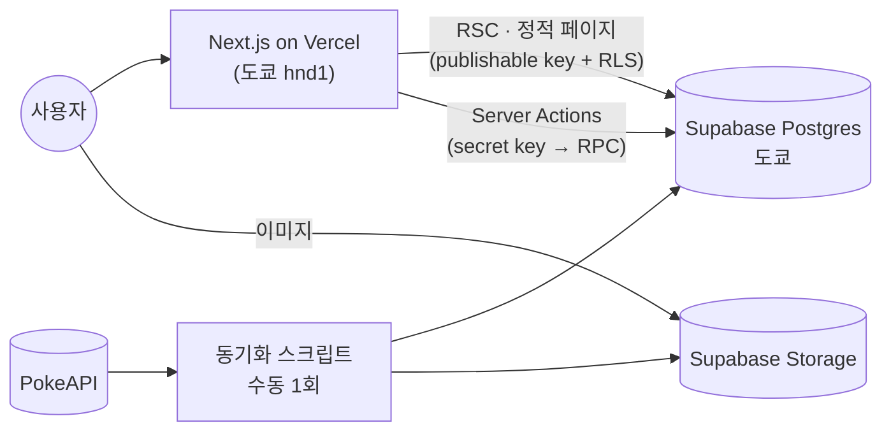

# Pokepedia

1세대 포켓몬 151마리 도감, 실루엣 보고 이름 맞히는 GB 배틀풍 게임, 맞히면 모이는 띠부씰 컬렉션.

2023년에 팀으로 만들었던 JSP 프로젝트([PikapediaProject](https://github.com/ottuck/PikapediaProject))를 요즘 스택으로 혼자 다시 만들어 본 사이드 프로젝트다.

**[pokepedia-rust-six.vercel.app](https://pokepedia-rust-six.vercel.app)** · [설계 문서](docs/system_design.md)

<table>
  <tr>
    <td width="50%"></td>
    <td width="50%"></td>
  </tr>
  <tr>
    <td></td>
    <td></td>
  </tr>
  <tr>
    <td></td>
    <td></td>
  </tr>
</table>

## 뭐가 있나

- **도감**: 151마리를 한 페이지에. 한국어·영어·일본어 이름이나 번호로 검색하고, 타입 필터와 정렬은 URL에 남는다.
- **상세**: 능력치, 특성, 진화 라인. 아트워크는 마우스(모바일은 손가락)를 따라 기우는 홀로그램 카드로 보여 주고, 색이 다른 모습으로 바꿔 볼 수 있다.
- **게임**: 실루엣만 보고 이름을 맞힌다. 싸우다 / 가방(힌트) / 포켓몬(스킵) / 도망치다. 방향키와 Z키로도 된다. 틀리면 HP가 깎이고, 연속으로 맞히면 점수 배율과 색이 다른 띠부씰 확률이 올라간다. 정답은 세 언어 이름 다 받는다.
- **컬렉션·랭킹**: 모은 띠부씰 151칸, 사용자별 최고 점수 랭킹.
- **계정**: 가입 없이 게스트로 바로 시작하고, 나중에 Google을 연결하면 기록이 그대로 넘어간다.
- 한국어·영어·일본어, 라이트/다크 모드.

## 스택

Next.js 16 (App Router, RSC, Server Actions) · React 19 · TypeScript · Tailwind CSS v4 · Motion · Zustand · Zod · next-intl ·
Supabase (Postgres, Auth, Storage) · Vitest · Playwright · Vercel



포켓몬 데이터와 이미지는 PokeAPI에서 한 번 긁어와 Supabase에 넣어 두고, 런타임에는 외부 API를 부르지 않는다. 도감과 상세(151 × 3개 언어)는 빌드 때 전부 prerender한다.

## 만들면서 고민한 것들

**정답이 브라우저에 안 가게.** 이름 맞히기 게임이라 개발자도구 열면 답이 보이면 곤란하다. 진행 중인 문제는 응답에 포켓몬 id나 이름을 싣지 않고 실루엣과 글자 수 마스크만 보낸다. 실루엣 파일명은 HMAC 키로 바꿔 두고, 진행 중인 round는 RLS로 아예 조회가 안 되게 막았다. 정답 키는 API에 노출되지 않는 private 스키마에 있다.

**판정은 서버, 커밋은 한 번에.** 규칙은 순수 TS(`rules.ts`)로 두고, 결과 반영(점수, 띠부씰, 다음 문제 생성)은 Postgres RPC 하나로 트랜잭션 처리한다. `version` 컬럼으로 낙관적 잠금을 걸어서 같은 답을 두 번 보내도 띠부씰은 한 번만 나온다.

**느렸던 답변 응답.** 처음엔 답 하나에 1.6–2.5초가 걸렸다. 알고 보니 Vercel 함수는 워싱턴, DB는 도쿄에 있었다. 함수 리전을 도쿄로 옮기고 순차 DB 왕복을 8번에서 3번으로 줄였더니 0.25초 정도로 내려왔다. 왕복 횟수는 다시 늘지 않게 테스트로 묶어 뒀다.

**게스트에서 Google 계정으로.** 가입 없이 시작한 게스트가 나중에 Google을 연결하면 같은 user id를 유지한다. 이미 가입한 Google 계정이 있으면 기록을 합칠 수 있는데, 1회용 티켓(DB에는 해시만, 원본은 httpOnly 쿠키로만)으로 처리하고 기록 이동이 성공한 뒤에만 게스트를 지운다. 안 쓰는 게스트는 pg_cron이 정리하되, 띠부씰이 한 장이라도 있으면 남긴다.

**권한은 DB에서 끝낸다.** 새 테이블은 권한 없이 만들고 필요한 GRANT와 RLS만 연다. 랭킹처럼 남의 기록을 보여 줘야 하는 곳은 닉네임·점수·콤보만 돌려주는 함수 하나로 해결했다.

**테스트는 깨지면 곤란한 것만.** 게임 규칙, 권한, 실제로 났던 버그 위주로 남기고 화면 문구 확인 같은 건 지웠다. RLS·RPC는 로컬 Supabase에 붙여서 돌리고, E2E는 도감 → 상세 → 언어 전환 → 게임 → 컬렉션 한 줄기만 Playwright로 확인한다.

**GB 느낌은 직접.** 원작 에셋은 쓰지 않았다. 트레이너 도트, 타이틀 화면, 효과음은 SVG·CSS·Web Audio로 만들었고 포켓몬 아트워크만 PokeAPI 이미지다.

더 자세한 건 [설계 문서](docs/system_design.md)에 정리해 뒀다.

## 로컬에서 돌리기

Node 24, pnpm, Docker가 필요하다.

```bash
pnpm install
pnpm supabase start            # 로컬 Postgres·Auth·Storage (Docker)
cp .env.example .env.local     # 값은 `pnpm supabase status -o env`에서 확인
pnpm sync:pokemon              # PokeAPI → 로컬 DB·Storage (처음 한 번, 안 하면 시드 3마리만)
pnpm dev
```

- `pnpm check`: lint · typecheck · format · 단위 테스트
- `pnpm test:db`: 로컬 Supabase RLS·RPC 테스트
- `pnpm test:e2e`: Playwright

---

<sub>Pokémon과 관련 이름·아트워크의 권리는 Nintendo, Creatures Inc., GAME FREAK inc.에 있습니다. 비상업적 팬 프로젝트입니다.</sub>
