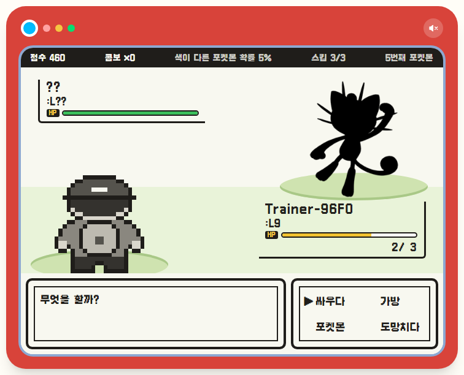
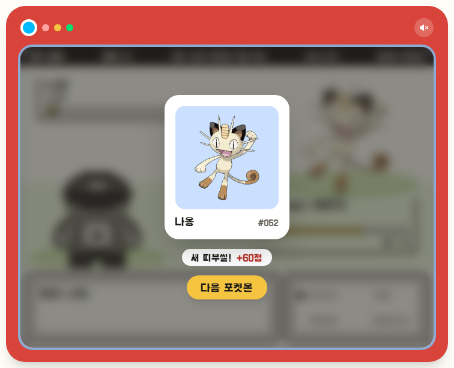
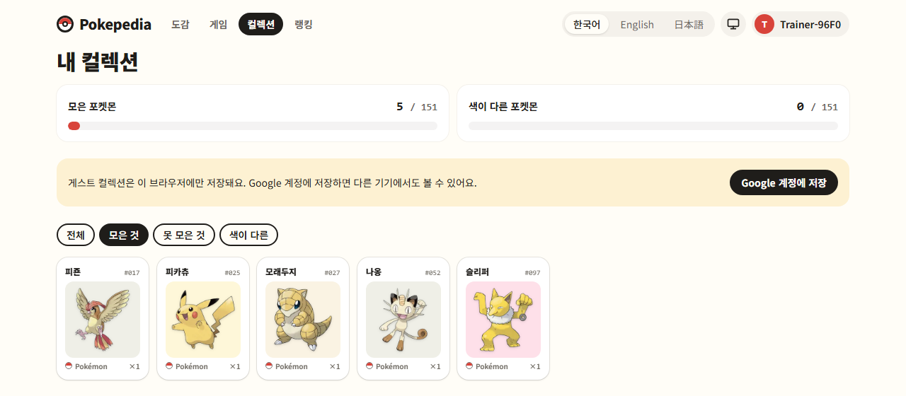
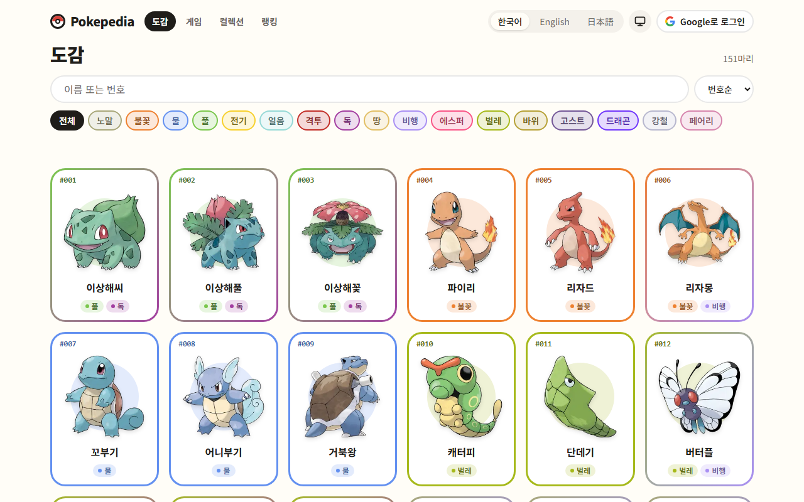
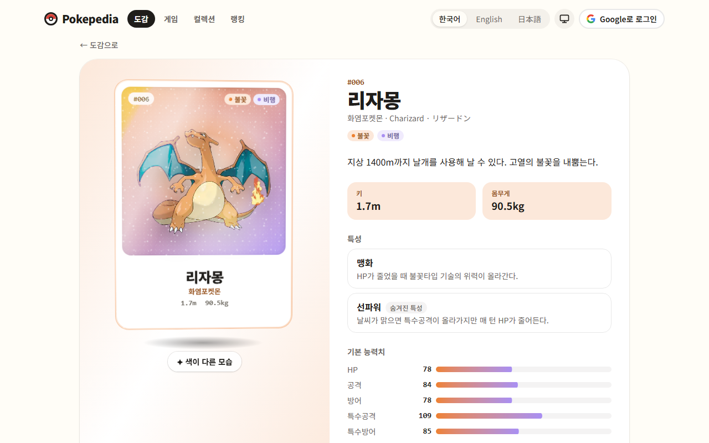
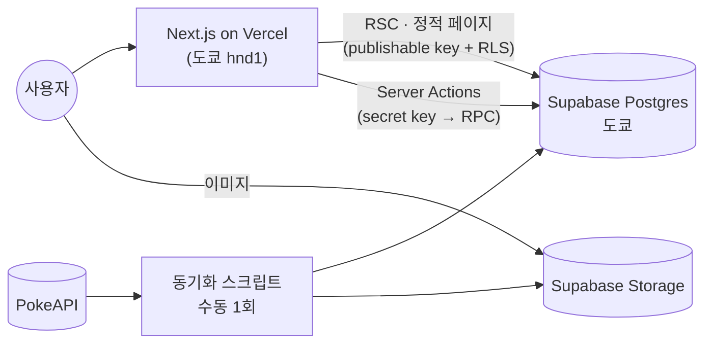

# Pokepedia

**한국어** · [English](README.en.md) · [日本語](README.ja.md)

1세대 포켓몬 151마리 도감, 실루엣 보고 이름 맞히는 GB 배틀풍 게임, 맞히면 모이는 띠부씰 컬렉션.

2023년에 팀으로 만들었던 JSP 프로젝트([PikapediaProject](https://github.com/ottuck/PikapediaProject))를 요즘 스택으로 혼자 다시 만들어 본 사이드 프로젝트다.

**[pokepedia-rust-six.vercel.app](https://pokepedia-rust-six.vercel.app)** · [설계 문서](docs/system_design.md)

<table>
  <tr>
    <td width="50%"></td>
    <td width="50%"></td>
  </tr>
  <tr>
    <td></td>
    <td></td>
  </tr>
  <tr>
    <td></td>
    <td></td>
  </tr>
</table>

## 뭐가 있나

- **도감**: 151마리를 한 페이지에. 한국어·영어·일본어 이름이나 번호로 검색하고, 타입 필터와 정렬은 URL에 남는다.
- **상세**: 능력치, 특성, 진화 라인. 아트워크는 마우스(모바일은 손가락)를 따라 기우는 홀로그램 카드로 보여 주고, 색이 다른 모습으로 바꿔 볼 수 있다.
- **게임**: 실루엣만 보고 이름을 맞힌다. 싸우다 / 가방(힌트) / 포켓몬(스킵) / 도망치다. 방향키와 Z키로도 된다. 틀리면 HP가 깎이고, 연속으로 맞히면 점수 배율과 색이 다른 띠부씰 확률이 올라간다. 정답은 세 언어 이름 다 받는다.
- **컬렉션·랭킹**: 모은 띠부씰 151칸, 사용자별 최고 점수 랭킹.
- **계정**: 가입 없이 게스트로 바로 시작하고, 나중에 Google을 연결하면 기록이 그대로 넘어간다.
- 한국어·영어·일본어, 라이트/다크 모드.

## 스택

Next.js 16 (App Router, RSC, Server Actions) · React 19 · TypeScript · Tailwind CSS v4 · Motion · Zustand · Zod · next-intl ·
Supabase (Postgres, Auth, Storage) · Vitest · Playwright · Vercel



포켓몬 데이터와 이미지는 PokeAPI에서 한 번 긁어와 Supabase에 넣어 두고, 런타임에는 외부 API를 부르지 않는다. 도감과 상세(151 × 3개 언어)는 빌드 때 전부 prerender한다.

## 로컬에서 돌리기

Node 24, pnpm, Docker가 필요하다.

```bash
pnpm install
pnpm supabase start            # 로컬 Postgres·Auth·Storage (Docker)
cp .env.example .env.local     # 값은 `pnpm supabase status -o env`에서 확인
pnpm sync:pokemon              # PokeAPI → 로컬 DB·Storage (처음 한 번, 안 하면 시드 3마리만)
pnpm dev
```

- `pnpm check`: lint · typecheck · format · 단위 테스트
- `pnpm test:db`: 로컬 Supabase RLS·RPC 테스트
- `pnpm test:e2e`: Playwright

---

<sub>Pokémon과 관련 이름·아트워크의 권리는 Nintendo, Creatures Inc., GAME FREAK inc.에 있습니다. 비상업적 팬 프로젝트입니다.</sub>
