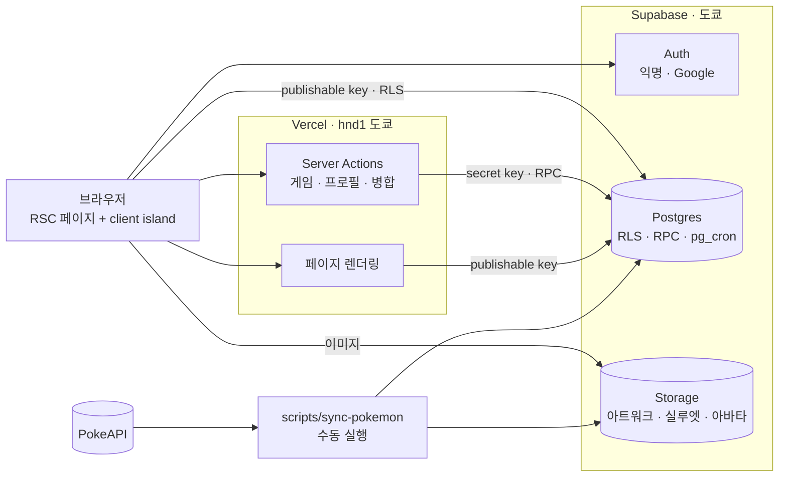

# Pokepedia System Design

Pokepedia의 구조와 규칙 중 코드만 봐서는 알기 어려운 것만 모은 문서다. 구조를 바꾸는 변경은 이 문서를 먼저 고친다.
소개와 실행 방법은 [README](../README.md)에 있다. 화면에서는 "게임"이라고 부르지만 코드와 URL은 `quiz`를 쓴다.

- [1. 전체 구조](#1-전체-구조)
- [2. 데이터](#2-데이터)
- [3. DB와 권한](#3-db와-권한)
- [4. 렌더링과 i18n](#4-렌더링과-i18n)
- [5. 게임](#5-게임)
- [6. 계정](#6-계정)
- [7. 개발과 배포](#7-개발과-배포)
- [8. 테스트](#8-테스트)

## 1. 전체 구조



| 영역   | 결정                                                                                      |
| ------ | ----------------------------------------------------------------------------------------- |
| 범위   | 1세대 #001–151. 타입은 현재 공식 기준(피피 = 페어리). 진화는 1세대 안에서 자른다          |
| 데이터 | PokeAPI는 동기화 스크립트에서만 쓴다. 런타임에는 외부 API를 부르지 않는다                 |
| 쓰기   | 브라우저는 RLS가 허용한 것만 읽고, 게임 상태를 바꾸는 쓰기는 Server Action → RPC로만 한다 |
| 상태   | 서버 데이터는 RSC, 클라이언트 상태(Zustand)는 게임 화면만                                 |
| 지역   | Vercel 함수(`vercel.json`의 `hnd1`)와 Supabase를 같은 도쿄에 둔다(아래)                   |
| 제외   | TanStack Query, Drizzle, GSAP. 구체적인 문제가 생기면 그때 검토                           |

**지역**: Vercel 함수 기본값인 워싱턴(`iad1`)에서는 도쿄 DB까지 쿼리마다 약 170ms가 걸려, 답변 한 번에 1.6–2.5초가 걸렸다. 함수를 도쿄로 옮기고 순차 DB 왕복을 8번에서 3번으로 줄여 약 0.25초가 됐다. DB 지역을 옮기면 `vercel.json`도 같이 바꾼다.

**환경**: Supabase는 remote 프로젝트 하나(`pokepedia`)를 Vercel Production과 Preview가 같이 쓴다. Preview에서 게임을 하면 실제 데이터가 된다. PR별 Supabase Branching은 유료라 쓰지 않고, DB 변경은 CI와 로컬 Supabase(`pnpm supabase start`)에서 검증한다. 프로덕션 도메인은 `pokepedia.dev`다.

## 2. 데이터

```
pnpm sync:pokemon  (로컬에서 수동 실행, idempotent)
  ① PokeAPI에서 1–151 species / pokemon / evolution-chain / ability 조회 (.cache/에 원본 캐시)
  ② Zod로 검증 → DB row로 변환
  ③ sharp: 아트워크 webp(normal, shiny) + 검은 실루엣 webp
  ④ Storage 업로드 + RPC sync_pokemon_catalog 한 번으로 DB 반영
```

- 기본 대상은 로컬(`.env.local`)이다. remote는 `--env-file .env.remote.local --yes`를 줘야만 실행되고, 사용자가 요청할 때만 돌린다.
- 도감은 빌드 때 prerender되므로 remote 동기화 결과는 다음 배포 뒤에 보인다.
- 실루엣 파일명은 `HMAC-SHA256(SILHOUETTE_SECRET, id)` 앞 16자리다. 파일명으로 정답을 바로 알 수 없게 하는 정도의 방어다.
- 정답 키는 게임 채점과 같은 `features/quiz/normalize.ts`로 만든다.
- 버킷: `pokemon-artwork`, `quiz-silhouette`(둘 다 public, 쓰기는 secret key만), `avatars`(§6).
- `supabase/seed.sql`은 로컬·CI용 3마리 카탈로그다(이미지 없음). production에는 적용하지 않는다.

## 3. DB와 권한

```sql
-- 도감 (public read)
pokemon (id 1–151, name/genus/description × ko·en·ja, type_1, type_2, 키·몸무게, 능력치 6종,
         evolves_from_id, evolution jsonb, artwork_path, shiny_artwork_path, is_legendary, is_mythical)
ability, pokemon_ability

-- 게임 비밀 데이터: Data API에 노출하지 않는 private 스키마
private.pokemon_quiz (pokemon_id, silhouette_path, answer_keys text[])

-- 사용자
profile      (id → auth.users, nickname 2–20자, avatar_path)      -- 가입 trigger가 생성
quiz_run     (user_id, status, end_reason fainted|fled, score, combo, best_combo, skips_left …)
quiz_round   (run_id, seq, pokemon_id, status active|cleared|failed|skipped, hp, hint_used, version …)
user_sticker (user_id, pokemon_id, variant normal|shiny, quantity)
private.guest_merge_ticket (token_hash, from_user_id, expires_at, consumed_at)
```

- 진행 중 run과 round는 사용자당 하나다(partial unique index).
- 스티커 = 포켓몬 × variant라 스티커 테이블을 따로 두지 않는다. 결과와 최근 획득은 `quiz_round`에서 읽는다.

**권한**: publishable key는 공개돼 있으므로, `anon`/`authenticated`에 허용한 것은 누구나 브라우저에서 직접 호출할 수 있다고 본다.

| 대상                                    | anon / authenticated                                  |
| --------------------------------------- | ----------------------------------------------------- |
| `pokemon`, `ability`, `pokemon_ability` | SELECT                                                |
| `private.*`                             | 없음                                                  |
| `profile`                               | 본인 SELECT, `nickname` 컬럼만 UPDATE                 |
| `quiz_run`, `user_sticker`              | 본인 SELECT                                           |
| `quiz_round`                            | 본인 SELECT, 끝난 round만(진행 중 문제는 숨김)        |
| 게임·병합·정리 RPC                      | 없음(secret key를 쓰는 서버만)                        |
| `leaderboard`, `my_leaderboard_rank`    | EXECUTE(닉네임·점수·콤보만 돌려주는 유일한 공개 창구) |
| storage `avatars`                       | Google 계정 본인 폴더만 INSERT/DELETE                 |

- 새 테이블에는 기본 권한이 없다(`api.auto_expose_new_tables = false`). migration마다 필요한 GRANT만 연다.
- 방어 계층: `proxy.ts`(세션 갱신·locale) → Server Action / RSC(`getClaims()`로 사용자 확인) → RLS(최종 방어선).

## 4. 렌더링과 i18n

| Route                                  | 렌더링      | 클라이언트 부분                     |
| -------------------------------------- | ----------- | ----------------------------------- |
| `/[locale]`                            | 정적        | `PokedexExplorer`: 필터·검색·정렬   |
| `/[locale]/pokemon/[id]`               | SSG 151 × 3 | 홀로그램 카드, "내 스티커" 배지     |
| `/[locale]/quiz`                       | 정적 셸     | `QuizGame` 전체                     |
| `/[locale]/leaderboard`                | ISR 60초    | "내 순위"                           |
| `/[locale]/collection`, `/[locale]/me` | 동적        | 필터, 카드 연출, 닉네임·아바타 편집 |

- 도감·상세는 cookie 없는 client(`lib/supabase/public.ts`)로 읽어 빌드 때 만든다. `dynamicParams = false`라 목록 밖 id는 DB 조회 없이 404다.
- 헤더 계정 메뉴와 "내 스티커" 배지는 브라우저에서 세션과 RLS로 읽는다. layout에서 cookie를 읽으면 모든 정적 페이지가 동적으로 바뀌기 때문이다.
- 도감과 컬렉션은 서버가 카드를 렌더링해 prop으로 넘기고, 클라이언트는 어떤 카드를 어떤 순서로 보일지만 정한다. 필터 상태는 URL(`?q=&type=&sort=`)과 동기화한다.
- OG 이미지는 사이트 기본 + 포켓몬별(151 × 3)로 빌드 때 만든다.
- i18n: next-intl, `ko`(기본)·`en`·`ja`, URL에 항상 locale이 붙는다. UI 문구는 `messages/*.json`에만 있고, 서버는 `code`만 돌려준다. 언어별 키가 같은지 테스트한다.

## 5. 게임

**규칙** (`features/quiz/rules.ts`의 상수와 순수 함수)

```
Run   : score, combo, skips_left = 3
Round : hp = 3, 힌트 1회

싸우다(정답)  → 점수 + 스티커 → 다음 round
싸우다(오답)  → hp −1, combo = 0.  hp 0이면 정답 공개 후 run 종료(fainted)
힌트          → 이름 앞 절반 공개, combo = 0, 이번 round 점수 ×0.5
넘기기(스킵)  → skips_left −1, combo = 0, 점수·스티커 없음
도망치다      → run 종료(fled)
```

- 점수: `base[hp] × 힌트 배율 × 콤보 배율`. `base = {3: 100, 2: 60, 1: 30}`, 콤보 배율은 최대 ×2.0.
- 색이 다른 스티커 확률: 콤보 1–4 → 5%, 5–9 → 10%, 10 이상 → 20%. 힌트를 쓴 round는 5%.
- 한 글자 이름(뮤)은 힌트로 아무것도 공개하지 않는다.
- 정답은 세 언어 이름을 모두 받는다. 입력과 정답 키를 같은 규칙으로 정규화한다(대소문자, 전각/반각, 히라가나→가타카나, 공백·기호 제거).
- 다음 포켓몬은 이번 run에서 안 나온 것 중에서 서버 CSPRNG로 고른다.

**API** (`features/quiz/actions.ts`): `startQuiz`, `submitAnswer`, `requestHint`, `skipQuizRound`, `fleeQuiz`. 입력은 Zod로 검증하고, 사용자는 항상 세션에서 정한다. 세션이 없으면 `startQuiz`가 익명 로그인한다.

- **판단은 TS, 커밋은 SQL**: `service.ts`가 신뢰할 수 있는 상태를 읽고 `rules.ts`로 결과를 계산한다. 반영은 RPC `quiz_commit` 하나가 한 트랜잭션으로 한다(round 갱신 → run 갱신 → 스티커 → 다음 round). `version` 낙관적 잠금으로 같은 답을 두 번 보내도 한 번만 반영된다.
- **정답 비노출**: 브라우저로 가는 round에는 포켓몬 id와 이름이 없다. 실루엣 파일명과 이름 마스크뿐이고, 진행 중 round는 RLS로도 숨긴다.
- **DB 왕복**: 정답 한 번에 순차 왕복 3번, 오답·힌트는 2번(§1 지역). 테스트로 늘지 않게 지킨다.
- **화면**: Zustand `useQuizStore`가 액션을 호출하고, phase(`lobby → intro → menu ⇄ answering → judging → hit | reveal → reward → … → gameover`)는 서버 결과를 어떤 순서로 연출할지만 정한다. 새로고침하면 로비로 돌아오고, 시작하면 진행 중 run을 이어한다. 이름을 입력하는 중에도 다른 명령을 누를 수 있다(입력창이 닫힌다). 휴대폰에서는 배틀이 시작되면 기기가 한 화면에 들어오게 스크롤하고, 기기 위의 터치로는 페이지가 스크롤되지 않게 한다.

## 6. 계정

- 도감은 로그인 없이 쓴다. 게임을 시작하면 게스트(익명 로그인)가 된다.
- **Google 연결**: 비로그인은 `signInWithOAuth`, 게스트는 `linkIdentity`로 같은 user id에 Google을 붙여 기록을 유지한다. `/auth/callback`은 같은 origin 경로로만 돌려보낸다.
- **게스트 기록 병합**: 이미 가입한 Google 계정이면 `linkIdentity`가 실패한다. 이때 게스트 기록을 그 계정으로 합칠 수 있다.
  1. `prepareGuestMerge`가 1회용 티켓을 만든다. DB에는 토큰의 해시만(10분), 원본은 httpOnly 쿠키로만 보낸다.
  2. Google로 로그인한 뒤 `/auth/callback`이 RPC `guest_merge_redeem`으로 한 트랜잭션에 티켓 소비, 게임 기록 이동, 스티커 합산을 한다.
  3. 이동이 성공한 뒤에만 게스트 user를 지운다.
- **비활성 게스트 정리**: pg_cron이 매일 `cleanup_inactive_guests()`를 돈다. 게스트이고, 60일 넘게 활동이 없고, 스티커가 0장이고, 진행 중 게임이 없는 계정만 지운다.
- **프로필**: 가입 trigger가 `Trainer-XXXX` 닉네임으로 만든다. 닉네임은 2–20자이고 본인만 바꾼다.
- **아바타**(Google 계정만): 브라우저가 256px 정사각형 webp로 만들어 `avatars/{user_id}/…`에 직접 올리고, `setAvatar`가 경로를 다시 확인한 뒤 `profile.avatar_path`를 바꾼다. 리더보드에는 보여 주지 않는다.
- **리더보드**: 사용자마다 한 판 최고 점수 하나. 공개 정보는 닉네임, 점수, 그 판의 최고 콤보뿐이다.
- 원격 Auth 설정(익명 로그인, Manual linking, Google, Site URL, Redirect URLs)은 Supabase 대시보드에서 한다. `config.toml`은 로컬에만 적용된다.

## 7. 개발과 배포

```
feature branch → PR ─┬─ GitHub CI (check / db / e2e)
                     └─ Vercel Preview
main ─┬─ Vercel Production 자동 배포
      └─ Supabase GitHub integration: 새 migration 자동 적용
```

- 머지 조건과 위험도 분류는 `CLAUDE.md` § Merge policy가 기준이다.
- CI: `check`(lint, typecheck, format, 단위 테스트), `db`(로컬 Supabase에 migration 적용, schema lint, 생성 타입 drift, RLS·RPC 테스트), `e2e`(Playwright). 문서만 바뀐 PR은 돌지 않는다.
- **DB 변경**: migration은 로컬에서 검증한 뒤 머지하면 자동 배포된다. Vercel과 Supabase가 동시에 배포되므로 migration은 현재 코드와 호환돼야 한다(expand → 코드 전환 → contract). 롤백하지 않고 새 migration으로 고친다. migration 뒤에는 `pnpm db:types`.
- **환경변수**

| 변수                                   | 노출              | 비고                                              |
| -------------------------------------- | ----------------- | ------------------------------------------------- |
| `NEXT_PUBLIC_SUPABASE_URL`             | public            |                                                   |
| `NEXT_PUBLIC_SUPABASE_PUBLISHABLE_KEY` | public            | `sb_publishable_…`                                |
| `SUPABASE_SECRET_KEY`                  | 서버 전용         | `sb_secret_…`. legacy `anon`/`service_role` 안 씀 |
| `SILHOUETTE_SECRET`                    | 동기화 스크립트만 | Vercel에는 없음                                   |

env schema(Zod)가 키 종류를 검사해서, secret key를 public 변수에 넣으면 실행되지 않는다.

- **UI**: 색은 `app/globals.css`의 토큰과 `features/pokemon/types.ts`(타입 18색)가 기준이다. 다크모드 코드는 남아 있지만 `lib/theme.ts`의 `DARK_MODE_ENABLED = false`로 꺼 두었다. 상세 페이지 카드는 마우스를 따라 기울고(터치는 기울이지 않음), 탭·클릭하면 한 바퀴 돈다. 모든 페이지 푸터에 비공식 팬 프로젝트이며 권리자와 관련이 없다는 고지를 둔다(`SiteFooter`). 원작 게임 에셋은 쓰지 않는다. 트레이너 도트, 타이틀 화면, 효과음은 SVG·CSS·Web Audio로 직접 만들었고(AI 도움), 포켓몬 아트워크만 PokeAPI 이미지다.

## 8. 테스트

깨지면 곤란한 것만 테스트한다. 렌더링·문구·DOM 구조 확인은 두지 않고, 화면은 Preview와 E2E로 본다.

| 도구                   | 대상                                                                                     |
| ---------------------- | ---------------------------------------------------------------------------------------- |
| Vitest                 | 게임 규칙·정규화, `service.ts`(정답 비노출, 남의 round 거부, 동시 제출, DB 왕복 횟수)    |
| Vitest                 | 보안 경계(병합 티켓·콜백, open redirect, 아바타 경로, env 키 종류, 닉네임), 번역 키 일치 |
| Vitest + RTL           | 실제로 났던 게임 화면 버그 2개(요청 실패 뒤 멈춤, 서버 오류 뒤 재입력)                   |
| Vitest + 로컬 Supabase | RLS·RPC 권한, 게스트 병합·정리, 리더보드 공개 범위, 아바타 권한                          |
| Playwright             | 핵심 여정 1개: 도감 검색 → 상세 → 언어 전환 → 게임 오답·정답 → 컬렉션                    |

- `pnpm test`, `pnpm test:db`(로컬 DB에 fixture를 쓴다), `pnpm test:e2e`(`pnpm dev`를 :3200에 띄운다).
- E2E는 진행 중 round의 정답이 RLS로 가려져 있어서 secret key로 로컬 DB를 직접 읽는다.
